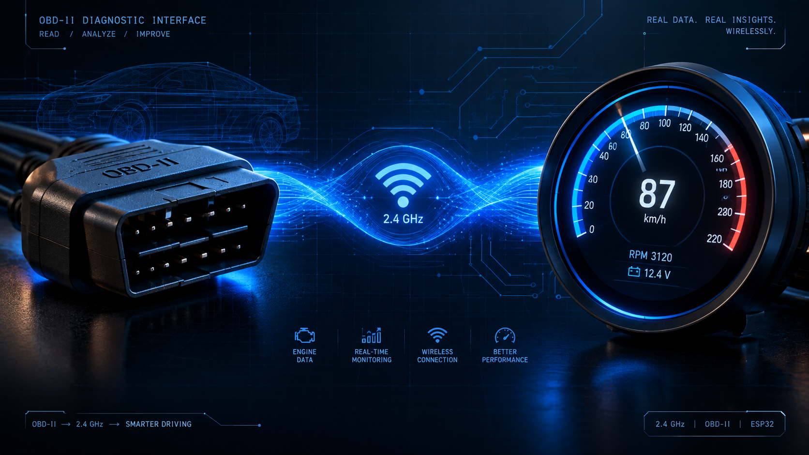
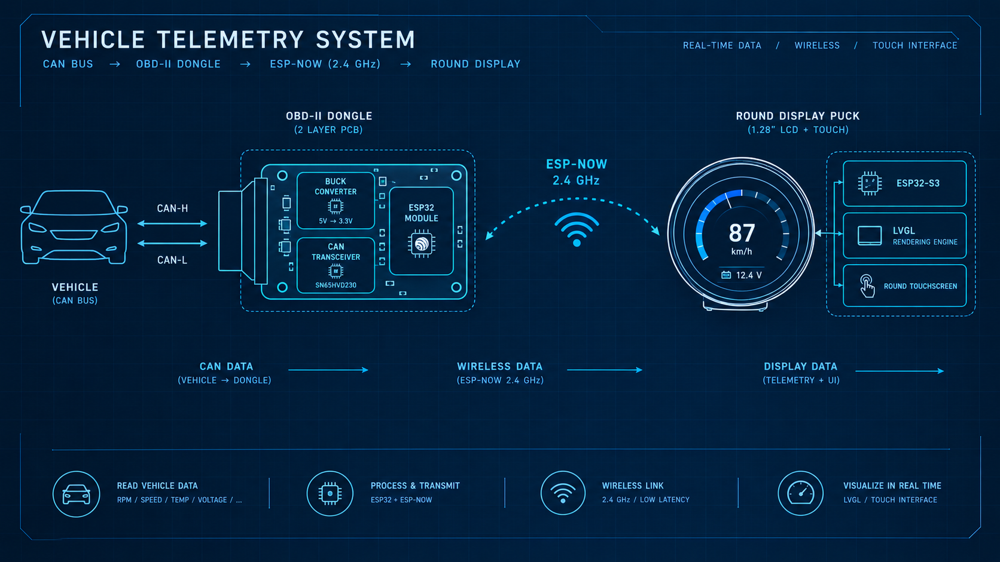
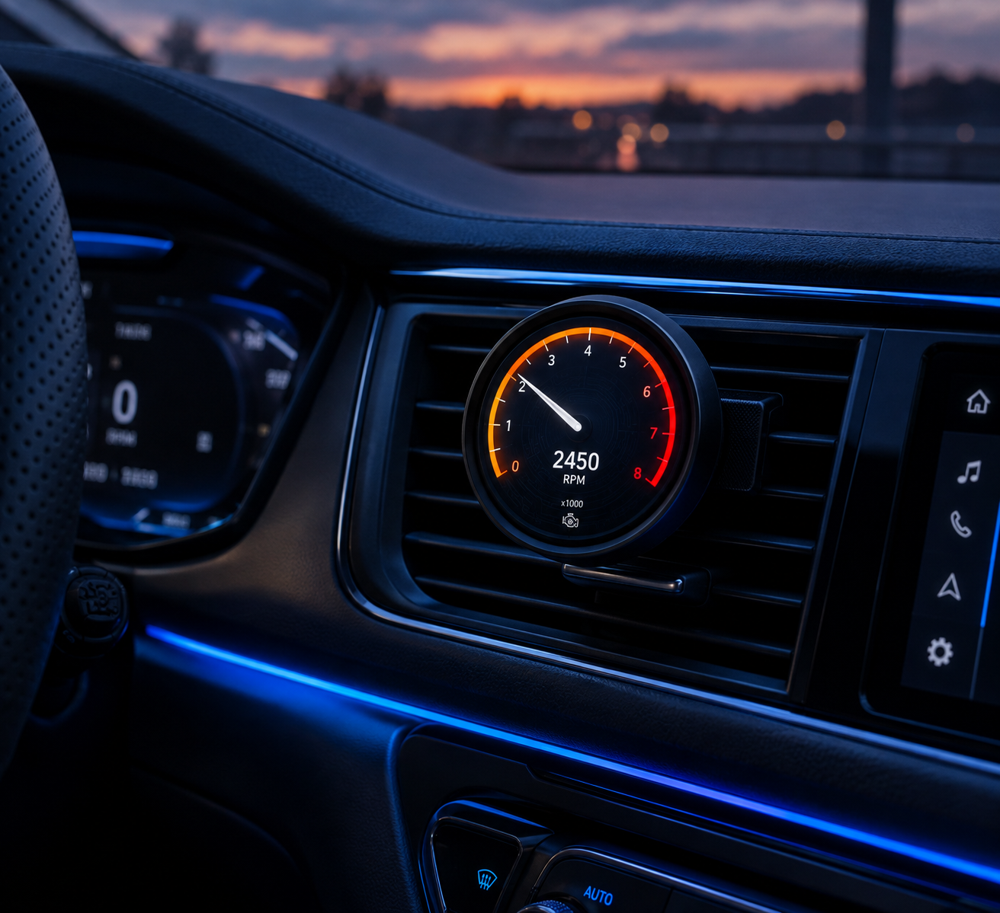
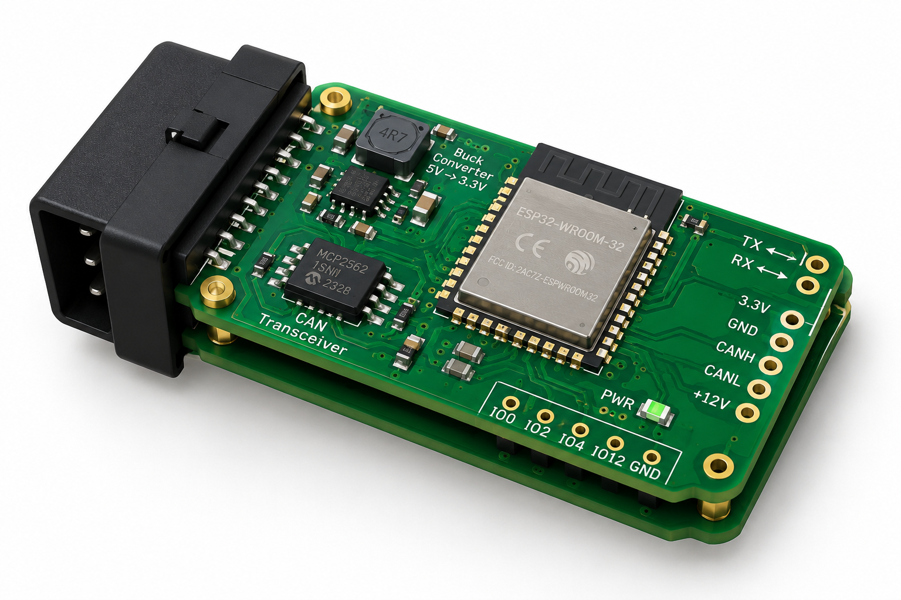

<div align="center">

# 🛰️ OpenGauge

### Modular Vehicle Telemetry and Infotainment Companion via OBD-II

*A split dual-node wireless dashboard system for real-time vehicle diagnostics.*

[](https://en.cppreference.com/)
[](https://docs.espressif.com/projects/esp-idf/en/latest/)
[](https://www.kicad.org/)
[](https://www.espressif.com/en/solutions/low-power-solutions/esp-now)
[](https://lvgl.io/)
[](#license--disclaimer)
[]()

</div>

---


*<p align="center">OpenGauge — bridging your vehicle's CAN bus to a dashboard-mounted circular telemetry display.</p>*

---

## 📖 Overview

**OpenGauge** is a final-year IT engineering capstone project that decouples vehicle diagnostic acquisition from in-cabin display, connecting the two over a low-latency wireless link. Instead of a single bulky OBD-II dongle with an integrated screen, OpenGauge splits the system into two purpose-built nodes:

- A **discreet acquisition dongle** that lives under the steering column, silently polling the vehicle's CAN bus.
- A **dashboard/vent-mounted display puck** with a crisp circular LCD, delivering smooth animated gauges without any wired connection to the OBD port.

The result is a modular, extensible, and automotive-grade telemetry platform suitable for gauge clusters, data logging, and future infotainment integration.

---

## 🖼️ Visual Reference

| System Architecture | Circular Gauge UI |
|:---:|:---:|
|  |  |


*<p align="center">Node 1 — OBD Acquisition Dongle, 2-layer PCB, KiCad 8 3D render.</p>*

---

## ✨ Key Features

### 🔌 Hardware / Electrical
- **Custom 2-layer PCB** for Node 1, sized to fit discreetly behind the J1962 OBD-II port.
- **Automotive-grade buck regulator** (TPS54302 / MP2315) stepping 12V (nominal vehicle rail, 9–16V transient tolerant) down to a clean 3.3V rail.
- **Dedicated CAN physical layer transceiver** (SN65HVD230) interfacing directly with the vehicle's high-speed CAN bus (CAN-H / CAN-L).
- **Input protection stage**: TVS diode transient suppression, reverse-polarity protection diode, and PTC resettable fuse on the 12V input rail.
- **ESP32-C3 module** (castellated-pad, SMD-mountable) as the acquisition MCU — compact footprint, native CAN-capable pin muxing, integrated Wi-Fi/BLE radio for ESP-NOW.
- **USB-C powered Display Node** with an **ESP32-S3** (dual-core Xtensa LX7, 8MB PSRAM) for graphics-heavy LVGL rendering.
- **Waveshare 1.28" Round Touch LCD** — GC9A01 driver (240×240, 4-wire SPI + DMA) with CST816S capacitive touch controller over I2C.

### 📡 Firmware / Protocols
- **ISO 15765-4 (CAN 11-bit, 500 kbps)** OBD-II Mode 01 PID polling: Engine RPM (`0x0C`), Vehicle Speed (`0x0D`), Coolant Temp (`0x05`), Intake Air Temp (`0x0F`).
- **ESP-NOW connectionless peer-to-peer link** — sub-5ms telemetry frame delivery, no router/AP dependency, MAC-address-paired nodes.
- **Custom lightweight binary telemetry packet schema** for minimal air-time and CPU overhead.
- **Watchdog-protected acquisition loop** with automatic PID re-query and CAN bus-off recovery handling.
- **Stretch Goal (Tier 3): BLE AVRCP metadata sniffing** — pairs with a smartphone as an AVRCP-capable BLE peripheral to extract and display the current Spotify track title / artist string on the display node.

### 🎨 Graphics / UI
- **LVGL v8/v9**-driven circular gauge cluster with animated needle sweep, smooth value interpolation, and low-latency screen redraw via DMA-backed SPI transfers.
- **Multi-page swipe UI** (touch-driven) cycling between RPM gauge, speed/temp composite view, and (stretch goal) media metadata card.
- **Configurable gauge redlines and color zones** (e.g., RPM redline warning arc) computed from live telemetry.
- **Boot splash and connection-status iconography** for wireless link health at a glance.

---

## 🧭 System Architecture

```
┌────────────────────────┐
│      VEHICLE ECU       │
│   (CAN-H / CAN-L Bus)  │
└──────────┬─────────────┘
           │  ISO 15765-4 (500 kbps)
           ▼
┌────────────────────────────────────────────┐
│           NODE 1 — OBD ACQUISITION DONGLE  │
│  ┌────────────┐     ┌────────────────┐     │
│  │ J1962 Port │ --> │ SN65HVD230 CAN │     │
│  │  (12V/GND) │     │  Transceiver   │     │
│  └─────┬──────┘     └───────┬────────┘     │
│        │                    │              │
│        ▼                    ▼              │
│  ┌────────────┐     ┌────────────────┐     │
│  │ Buck Reg.  │     │  ESP32-C3      │     │
│  │ 12V→3.3V   │ --> │  (CAN parse +  │     │
│  │(TPS54302)  │     │   PID polling) │     │
│  └────────────┘     └───────┬────────┘     │
└─────────────────────────────┼──────────────┘
                              │
                              │  ESP-NOW (2.4GHz, <5ms)
                              ▼
┌─────────────────────────────────────────────────────┐
│           NODE 2 — DISPLAY NODE                     │
│  ┌───────────────┐     ┌────────────────────┐       │
│  │  ESP32-S3     │ --> │  LVGL v8/v9 Engine │       │
│  │ (Dual-Core,   │     │  (Gauge Rendering) │       │
│  │  8MB PSRAM)   │     └─────────┬──────────┘       │
│  └───────┬───────┘               │                  │
│          │  4-wire SPI + DMA     ▼                  │
│          ▼                 ┌───────────────────┐    │
│  ┌─────────────────┐       │ GC9A01 240x240    │    │
│  │  CST816S Touch  │ <---> │ Round LCD Panel   │    │
│  │  (I2C)          │       └───────────────────┘    │
│  └─────────────────┘                                │
│          USB-C Powered (Dash/Vent Mounted)          │
└─────────────────────────────────────────────────────┘
```

---

## 📁 Repository Structure

```
opengauge/
├── hardware/
│   ├── obd_node_pcb/
│   │   ├── kicad_project/          # .kicad_pro, .kicad_sch, .kicad_pcb
│   │   ├── gerbers/                # Fabrication-ready Gerber + drill files
│   │   ├── bom/                    # Bill of Materials (CSV/XLSX)
│   │   └── 3d_renders/             # STEP/PNG exports
│   └── shared_symbols_footprints/  # Custom KiCad libraries
│
├── firmware/
│   ├── obd_node/                   # ESP32-C3 acquisition firmware
│   │   ├── src/
│   │   │   ├── can_driver.c
│   │   │   ├── obd_pid_parser.c
│   │   │   ├── espnow_tx.c
│   │   │   └── main.c
│   │   ├── include/
│   │   └── platformio.ini
│   │
│   └── display_node/               # ESP32-S3 display firmware
│       ├── src/
│       │   ├── lvgl_conf/
│       │   ├── ui/
│       │   │   ├── gauge_rpm.c
│       │   │   ├── gauge_speed_temp.c
│       │   │   └── media_card.c
│       │   ├── espnow_rx.c
│       │   ├── touch_driver.c
│       │   └── main.c
│       ├── include/
│       └── platformio.ini
│
├── mechanical/
│   ├── dongle_enclosure/           # STL + STEP files, J1962 shroud
│   └── display_puck_mount/         # STL + STEP files, vent/dash clip
│
├── docs/
│   ├── images/                     # README visual assets
│   ├── wiring_diagrams/
│   ├── datasheets/
│   └── project_report.pdf
│
├── LICENSE
└── README.md
```

---

## 🔧 Pin Mapping

### Node 1 — ESP32-C3 (OBD Acquisition Dongle)

| ESP32-C3 Pin | Function              | Connected To               |
|:------------:|:-----------------------|:----------------------------|
| GPIO4        | `CAN_TX` (TWAI TX)      | SN65HVD230 `TXD`             |
| GPIO5        | `CAN_RX` (TWAI RX)      | SN65HVD230 `RXD`             |
| GPIO2        | Status LED — Power      | Green LED (via 330Ω resistor)|
| GPIO3        | Status LED — Link       | Blue LED (via 330Ω resistor) |
| GPIO8        | Status LED — Fault      | Red LED (via 330Ω resistor)  |
| 3V3          | Regulated Supply        | TPS54302 `VOUT`              |
| GND          | Common Ground           | Vehicle Chassis / J1962 Pin 4|

### Node 2 — ESP32-S3 (Display Node → Waveshare 1.28" GC9A01/CST816S)

| ESP32-S3 Pin | Function        | Display Module Pin |
|:------------:|:-----------------|:--------------------|
| GPIO11       | SPI `MOSI`        | `SDA` (Display Data) |
| GPIO12       | SPI `SCLK`        | `SCL` (Display Clock) |
| GPIO10       | SPI `CS`          | `CS`                  |
| GPIO9        | `DC` (Data/Cmd)   | `DC`                  |
| GPIO14       | `RST`             | `RES`                 |
| GPIO13       | Backlight PWM     | `BL`                  |
| GPIO7        | I2C `SDA` (Touch) | `TP_SDA` (CST816S)    |
| GPIO6        | I2C `SCL` (Touch) | `TP_SCL` (CST816S)    |
| GPIO15       | Touch `INT`       | `TP_INT`               |

> ⚠️ Pin assignments are configurable via `sdkconfig` / `platformio.ini` build flags — table reflects default reference firmware wiring.

---

## 🗓️ Development Roadmap (8-Week Capstone Sprint)

| Week | Milestone | Focus Area |
|:----:|:----------|:------------|
| **1** | Proof-of-Concept | Breadboard ESP32-C3 + MCP2515/SN65HVD230, validate CAN sniffing against a bench ECU simulator or real vehicle OBD port. |
| **2** | OBD Protocol Layer | Implement ISO 15765-4 Mode 01 PID request/response parsing (RPM, Speed, Coolant Temp, Intake Temp). |
| **3** | Wireless Link | Establish ESP-NOW pairing between ESP32-C3 and ESP32-S3; benchmark round-trip latency (<5ms target). |
| **4** | Hardware Fabrication | Finalize KiCad schematic + layout for Node 1 dongle PCB; submit Gerbers for fab; order SMD components. |
| **5** | Display Bring-Up | Bring up Waveshare 1.28" GC9A01 over SPI/DMA; integrate LVGL v8/v9; validate CST816S touch input. |
| **6** | UI/UX Integration | Build animated circular gauge cluster, multi-page swipe navigation, live telemetry binding via ESP-NOW RX. |
| **7** | Enclosure + Stretch Goal | 3D-print/CAD dongle + display puck enclosures; attempt BLE AVRCP Spotify metadata stretch goal. |
| **8** | Final Integration & Defense | End-to-end vehicle testing, documentation finalization, capstone defense presentation & demo. |

---

## 🛠️ Getting Started

### Prerequisites
- [PlatformIO](https://platformio.org/) or ESP-IDF v5.x toolchain
- [KiCad 8](https://www.kicad.org/) for hardware design files
- A vehicle (or CAN bus simulator) with an accessible J1962 OBD-II port
- Basic SMD soldering/rework capability for dongle assembly

### Flashing the Firmware
```bash
# Clone the repository
git clone https://github.com/<your-username>/opengauge.git
cd opengauge

# Flash the OBD Acquisition Node (ESP32-C3)
cd firmware/obd_node
pio run --target upload

# Flash the Display Node (ESP32-S3)
cd ../display_node
pio run --target upload
```

---

## 📜 License & Disclaimer

This project is released under the **MIT License** — see [`LICENSE`](LICENSE) for full terms.

> ⚠️ **Automotive Safety Disclaimer**
> OpenGauge is designed strictly as a **passive, read-only telemetry monitoring device**. It queries standard OBD-II Mode 01 PIDs and does **not** transmit, inject, or alter any CAN bus frames, ECU parameters, or vehicle control systems. This project is intended for educational and diagnostic-display purposes only and is **not** a certified automotive safety, emissions, or control device. Use of this hardware is entirely at the user's own risk; the authors assume no liability for vehicle malfunction, electrical damage, or safety incidents arising from installation or use. Always ensure proper fusing, isolation, and OBD-II port compliance before connecting any custom hardware to a vehicle's diagnostic bus.

---

<div align="center">

**OpenGauge** — Built with ❤️ as a final-year IT Engineering Capstone Project.

</div>